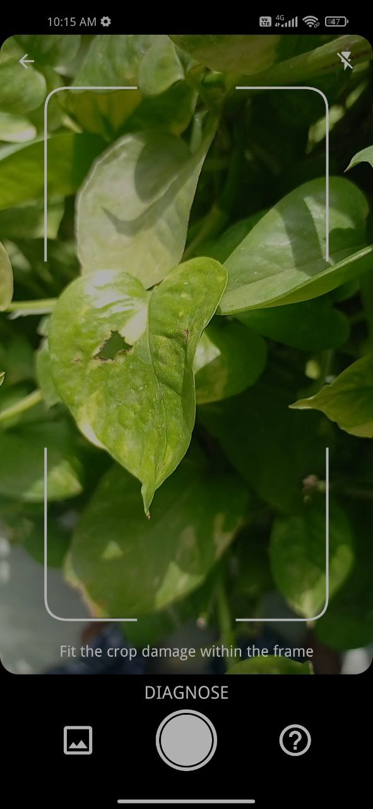

<h1 align="center">Android Coding Jam 
 
<h3 align="centre"> 
     Hope you all are doing well 
</h3> 
<h3 align ="centre">Let's Have a look on my Project PlantaeLand</h3> 
<h3> :collision: Problem Statement:</h3>

As we all know that environment play an important role in our everyday life.And you know the trees play an important role in the environment all the living things directly or indirectly depends on plant. So caring or taking of plant just like human is also necessary.One of the problem faced by the people is that they are not able to  remind that at what time we have to feed the plant.Due to which the plant dead. 

<h3>:fire: Proposed Solution</h3>

  This project i.e. **PlantaeLand** helps the user to remind about the plant whom you are taking . This app also helps the user to search about the plant using Google API's.As of now this app can only used by one person.
 

  
 ## Prerequisite
* Android Studio installed in your system.
   

🚀 Language used in creating this is Kotlin 
  
  
##⚡**UI** of PlantaeLand
 
<h4> 1. This one is the spash screen of the app .I included animation in it .</h4>

 
  
<h4> 2. This one is the opening screen of the app .This screen also opens with  animation  .</h4>

  

<h4> 3. This one is the referenece screen for the user to know more about the app .This screen also opens with  animation .I used scroable view using viewpager2</h4>

  

  

  

<h4> 4. Now on clicking on get started button main screen of the app opens.</h4>

  

<h4> 5. Now on clicking on get reminder button in bottom navigation bar.A screen opens with such a layout in which you can add any reminder</h4>

  

<h4> 6. Now on clicking on mygarden button in bottom navigation bar.A screen opens with such a layout in which you can add any plant in your garden and track their progress as per months,days and years</h4>

     
<h4> 7. Now if you want to know about your plant disease you can do this just by taking it's pic from camera or gallery</h4>

## 💻 Techs Used 
- [Kotlin](https://kotlinlang.org/) - First class and official programming language for Android development.
- [Coroutines](https://kotlinlang.org/docs/coroutines-overview.html) - For Asynchronous.
- [Flow](https://kotlin.github.io/kotlinx.coroutines/kotlinx-coroutines-core/kotlinx.coroutines.flow/-flow/) - A cold asynchronous data stream that sequentially emits values and completes normally or with an exception.
- [StateFlow](https://developer.android.com/kotlin/flow/stateflow-and-sharedflow) - StateFlow is a state-holder observable flow that emits the current and new state updates to its collectors.
- [Android Architecture Components](https://developer.android.com/topic/architecture) - Collection of libraries that help you design robust, testable, and maintainable apps.
  - [ViewModel](https://developer.android.com/topic/libraries/architecture/viewmodel) - Stores UI-related data that isn't destroyed on UI changes.
  - [ViewBinding](https://developer.android.com/topic/libraries/view-binding) - Generates a binding class for each XML layout file present in that module and allows you to more easily write code that interacts with views.
  - [Room Database](https://developer.android.com/training/data-storage/room) - Room is an android library which is an ORM which wraps android's native SQLite database.
  - [DifferentAPI](https://dagger.dev/hilt/) - Standard API for search about plant name  like tomato cucumber etc.
  - [Dagger-Hilt](https://dagger.dev/hilt/) - Standard library to incorporate Dagger dependency injection into an Android application.
  - [Tensorflow]() - Standard python based machine learning library for detecting plant diseases into an Android application.
     

     

 
<h2>Future scope</h2>
<h4>The app is currently used by private or individual so i am thinking to add some more features in future in it like identify using camera about the plant diseases so that our farmers can also use it at large level or community level to know more the plant diseses just by clicking the photo.
</h4>

  
 
<h2>Link  of the repository that contains code of the following readme. Have a visit on this</h2>

### 🙋‍♂️ Hope you like my app .If you like don't forget to like the repository  

<h4 align= "centre">If you are facing any issue then free to contact me through email</h2>

- 📫Email : bhawnabc2002@gmail.com
  
  
<h3 align="centre"> 
     Thanks for being here
</h3>

 
 
 
 
